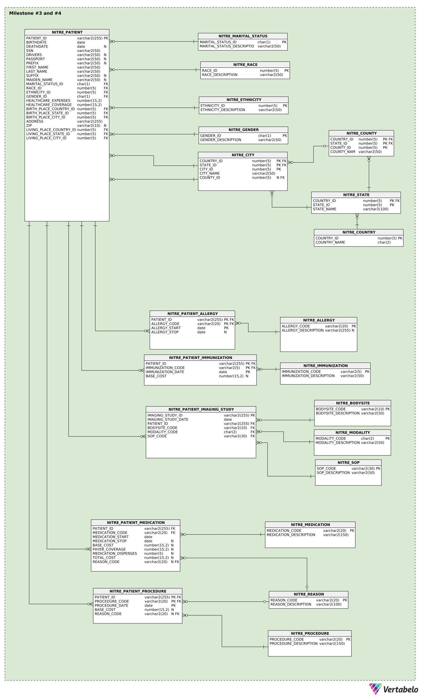
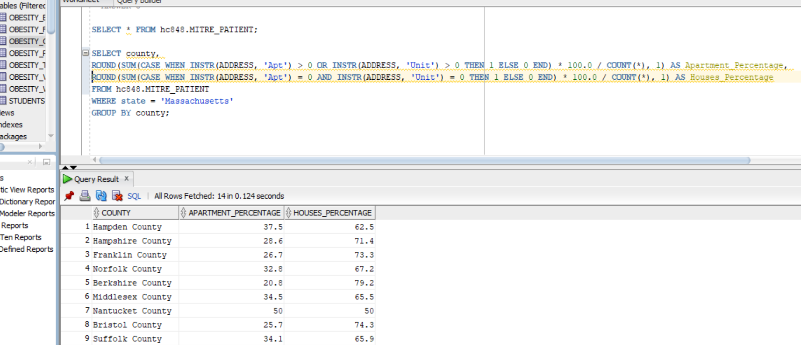

# # Clinical Patient Database Project - Exploratory Analysis and Normalization

This project involves **exploratory data analysis** and **data normalization** on a synthetic clinical patient dataset. The primary objective was to understand data distributions, identify missing values, and design a **normalized ER model** specific to this dataset.

## Project Context
- This project was conducted as part of a Database Management Systems course, focusing on:
  - **Exploratory Data Analysis:** Understanding demographic distributions and data patterns.
  - **Data Normalization:** Normalizing the dataset to **Third Normal Form (3NF)** to eliminate redundancy and maintain integrity.
  - **ER Modeling:** Designing an ER diagram tailored to this specific dataset.
- **Disclaimer:** The ER model is **data-specific** and was designed as an academic exercise. It is not intended to be a production-ready solution for hospital management systems.

---

## ER Diagram
The normalization process was achieved through multiple milestones:
- **Milestone 1:** Initial denormalized dataset with repetitive demographic attributes.
- **Milestone 2:** Partial normalization by separating dependent entities.
- **Milestone 3 and 4:** Full normalization to **Third Normal Form (3NF)** with lookup tables and relational constraints.




---

## Exploratory Data Analysis
Before normalization, exploratory analysis was performed to understand the data distribution and identify missing values. Key queries include:
1. **Demographic Distribution:** Analyzing patient demographics by gender, age, race, and ethnicity.
2. **Missing Values Analysis:** Calculating the percentage of missing data for key attributes.
3. **Statistical Summaries:** Descriptive statistics for healthcare expenses and coverage.

### Example Queries and Screenshots

- **Statistical Summary Query: Distribution (%) of patients living in houses (or similar) vs patients living in apartments (or similar) in each County in Massachusetts**
    ```sql
    SELECT 
      county, 
      ROUND(SUM(CASE WHEN INSTR(ADDRESS, 'Apt') > 0 OR INSTR(ADDRESS, 'Unit') > 0 THEN 1 ELSE 0 END) * 100.0 / COUNT(*), 1) AS Apartment_Percentage,
      ROUND(SUM(CASE WHEN INSTR(ADDRESS, 'Apt') = 0 AND INSTR(ADDRESS, 'Unit') = 0 THEN 1 ELSE 0 END) * 100.0 / COUNT(*), 1) AS Houses_Percentage  
    FROM MITRE_PATIENT
    WHERE state = 'Massachusetts'
    GROUP BY county;
    ```
- **Result Screenshot:**
    

---

## Key Features
- **Exploratory Analysis:**
  - Analyzed demographic distributions and missing values using **Subqueries, JOINs, Conditional CASE statements, GROUP BY**, and **Aggregation Functions**.
  - Visualized query results to understand data patterns and inconsistencies.
- **Data Normalization:**
  - **Milestone 1 and 2:** Partial normalization with dependent entities like Allergies, Immunizations, and Procedures.
  - **Milestone 3 and 4:** Full normalization to **Third Normal Form (3NF)** with lookup tables and relational constraints.
- **ER Modeling:**
  - Designed an ER diagram specific to this dataset using **Vertabelo**.
  - Established referential integrity using **Primary Keys (PKs)** and **Foreign Keys (FKs)**.

---

## Technologies Used
- **Database Management System:** Oracle SQL
- **ER Modeling Tool:** Vertabelo
- **Development Tools:** SQL Developer, Git

---


## Lessons Learned and Challenges
- **Exploratory Analysis:** Helped understand data distributions and missing values, guiding the normalization process.
- **Normalization to 3NF:** Reduced redundancy and improved data integrity, but required careful handling of complex relationships.
- **Challenges:** Ensuring referential integrity across multiple lookup tables and optimizing complex joins for analysis.

---

